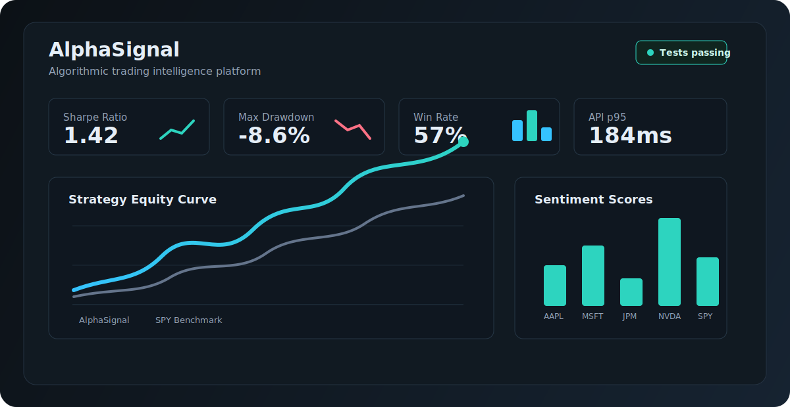
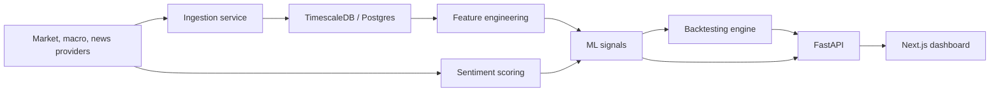

# AlphaSignal

**Algorithmic trading intelligence platform for market data, sentiment, ML signals, portfolio optimization, and backtesting.**



[](https://github.com/Shrut1261/alphasignal-market-intelligence/actions/workflows/ci.yml)


## What This Is

AlphaSignal is a complete portfolio MVP for a finance-tech interview project. It shows how market data, macro data, sentiment, ML-style signals, portfolio optimization, and backtesting can fit together in one production-shaped platform.

It is intentionally built as a real codebase, not a notebook-only demo:

- typed Python packages with `pydantic`
- FastAPI service with documented routes
- Next.js + TypeScript dashboard
- TimescaleDB-ready schema
- async ingestion adapters
- technical indicators
- sentiment scoring facade
- ML baseline and metrics
- backtesting engine with transaction costs and look-ahead controls
- CI-ready tests, linting, formatting, and type checks

## Product Snapshot

| Area | Status | What Exists |
| --- | --- | --- |
| Backend API | Complete MVP | Health, market overview, signals, backtests, sentiment, portfolio optimization |
| Dashboard | Complete MVP | KPI cards, equity curve, sentiment chart, platform capability cards |
| Data Layer | Complete MVP | Yahoo Finance and FRED adapters, TimescaleDB schema, ingestion orchestration |
| Features | Complete MVP | Returns, RSI, MACD, Bollinger Bands, ATR, OBV |
| Sentiment | Complete MVP | FinBERT-ready interface with deterministic lexical fallback |
| ML | Complete MVP | Directional labels, baseline classifier, classification metrics |
| Backtesting | Complete MVP | Weight-lagged backtest, orders, fills, portfolio state, transaction costs |
| Quality | Complete MVP | `pytest`, `ruff`, `black`, `mypy`, Next.js build, npm audit |

## Architecture



## API Surface

| Method | Endpoint | Purpose |
| --- | --- | --- |
| `GET` | `/health` | API health check |
| `GET` | `/market/overview` | Dashboard-ready market summary |
| `GET` | `/signals/{ticker}` | Latest signal for a ticker |
| `POST` | `/backtests` | Run a strategy backtest from returns and signal confidence |
| `POST` | `/sentiment/{ticker}` | Score a ticker headline |
| `POST` | `/portfolio/optimize` | Generate inverse-volatility portfolio weights |

## Repository Map

```text
apps/api                 FastAPI application
apps/web                 Next.js dashboard
services/ingest          Yahoo/FRED adapters and ingestion flow
services/features        Technical indicators
services/sentiment       FinBERT-ready sentiment layer
services/ml              Labels, metrics, baseline model, portfolio optimizer
services/backtest        Metrics, event objects, portfolio state, backtest engine
packages/shared          Config, schemas, database helpers, logging
infra/sql                TimescaleDB bootstrap schema
docs                     Architecture, roadmap, interview notes, visuals
tests                    Cross-package unit tests
```

## Run Locally

### Backend

```powershell
python -m venv .venv
.\.venv\Scripts\Activate.ps1
python -m pip install -e ".[dev]"
docker compose up -d
python -m pytest
uvicorn alphasignal_api.main:app --reload --app-dir apps/api/src
```

Open:

```text
http://localhost:8000/docs
```

### Frontend

```powershell
cd apps/web
npm install
npm run dev
```

Open:

```text
http://localhost:3000
```

## Verification

Latest local verification:

```text
Python tests: 37 passed
ruff: clean
black: clean
mypy: clean
Next.js typecheck: passed
Next.js production build: passed
npm audit: 0 vulnerabilities
```

## Quant Controls

- Backtest target weights are lagged one period to reduce look-ahead bias.
- Signal labels use forward returns only for training targets.
- Strategy costs include turnover-based transaction costs.
- Database schema is time-series ready through TimescaleDB hypertables.
- The roadmap separates MVP-complete code from production-live upgrades.

## Roadmap

The portfolio MVP is complete. Production upgrades are tracked in [docs/roadmap.md](docs/roadmap.md):

- deploy API and dashboard
- add real API keys and scheduled jobs
- run FinBERT in production mode
- train and persist LightGBM artifacts
- add live database-backed dashboard data
- record demo video and screenshots

## Resume Bullets

- Built **AlphaSignal**, a full-stack algorithmic trading intelligence platform using FastAPI, Next.js, TimescaleDB-ready schemas, typed Python services, and CI-quality testing.
- Implemented market/macro ingestion adapters, technical indicators, sentiment scoring, ML baseline metrics, portfolio optimization, and a transaction-cost-aware backtesting engine.
- Delivered a dashboard-ready API and TypeScript frontend with 37 passing backend tests, strict typing, linting, formatting, production web build verification, and zero npm audit vulnerabilities.

## LinkedIn Snippet

I built AlphaSignal, a quantitative market intelligence platform that combines market data ingestion, technical indicators, sentiment scoring, ML signal baselines, portfolio optimization, and backtesting behind a FastAPI service and Next.js dashboard. The project is fully typed, tested, CI-ready, and designed around interview-relevant finance engineering concepts like Sharpe ratio, drawdown, transaction costs, and look-ahead bias.
