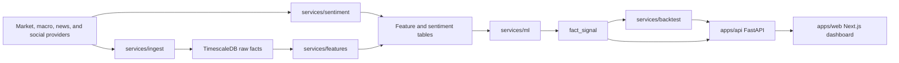

# AlphaSignal Architecture

## Bias Controls

- Time-series splits only move forward in time.
- Feature tables must use data available at or before each signal timestamp.
- Backtests consume prior close or next open fills depending on strategy configuration.
- The ticker universe will be versioned to discuss survivorship bias explicitly.
